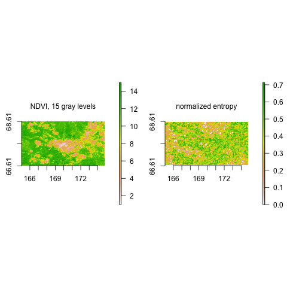

<!-- README.md is generated from README.Rmd. Please edit that file -->

```{r, include = FALSE}
knitr::opts_chunk$set(
  collapse = TRUE,
  comment = "#>",
  fig.path = "man/figures/README-",
  out.width = "100%"
)
```

# StrucDiv

<!-- badges: start -->
<!-- badges: end -->

Spatial structural diversity refers to the spatial, i.e. horizontal, configuration of landscape elements. Hereafter, 'spatial structural diversity' will be used synonymous to 'structural diversity'. The `StrucDiv` package provides methods to quantify structural diversity in raster data, i.e. data in gridded field format. With these methods, structural diversity features can be detected. Structural diversity features have also been called latent landscape features. Typical structural diversity features include narrow borders, line features, patches and hotspots [@Schuhetal2021].
The methods are based on the spatial arrangement of pixels as pairs, based on @Haralick1973. Pixels are considered as pairs at user-specified distances and angles. Distance refers to the distance between two pixels that are considered a pair. Angle refers to the angle at which two pixels are considered a pair. Angles can be horizontal or vertical direction, or the diagonals at 45° or 135°. The direction-invariant version considers all angles. The area within which pixel value co-occurrences are investigated is realized with a moving window approach. Windows overlap and move by one pixel at a time.

### `strucDiv`: Scale-specific spatial structural diversity quantification

The `strucDiv` function quantifies structural diversity on a particular scale, which is defined by the size of the moving window. Within the area captured by the moving window, pixel values are considered as pairs with the specified spatial arrangement, as described above.
The frequencies of pixel pair occurrences are normalized by the total number of pixel pairs, which returns the gray level co-occurrence matrix (GLCM). The GLCM contains the empirical probabilities $P_{i,j}$ that pixel values v$_{i}$ and v$_{j}$ occur as a pair at the specified distance and angle(s), in the area captured by the moving window. The total number of pixel pairs depends on the spatial scale, i.e. on the size of the moving window. The size of the square moving window is defined by its window side length (WSL).
Structural diversity is based on empirical probabilities of pixel value co-occurrence. The output map is called a '(spatial) structural diversity map' and it is returned as a raster layer.  The output map represents structural diversity quantified on a specific scale.

### `strucDivNest`: Cross-scale spatial structural diversity quantification

The `strucDivNest` function allows to combine information from two different scales with an empirical Bayesian approach and a Beta-Binomial model. Two scales are nested inside each other - a larger, outer scale and a smaller, inner scale. Three different nesting schemes are available, whereby the inner scale is always a moving window. 
The outer scale can either be another mowing window, a block, or the domain (i.e. the input raster). 
The outer scale is used as prior information, and the inner scale serves as likelihood to estimate posterior probabilities of pixel value co-occurrences. 
In the Beta-Binomial model both, the prior and the posterior follow a beta distribution, and the likelihood follows a conditional binomial distribution. 
Posterior probabilities are estimated with mean estimates. 
Structural diversity is quantified based on these posterior probabilities. 
The final map is called a '(spatial) structural diversity map' and is returned as a raster layer. The output map represents structural diversity, quantified across different spatial scales, which are defined by the outer scale and the inner scale.

## Spatial structural diversity metrics

Spatial structural diversity metrics include: contrast, dissimilarity, homogeneity, entropy in different formulations, and normalized entropy. Structural diversity entropy includes a difference weight $\delta \in \{0, 1, 2\}$, which weighs the differences between pixel values  v$_{i}$ and v$_{j}$, using either absolute, or square weights. When $\delta$ = 0, structural diversity entropy corresponds to Shannon entropy [@Shannon]. Shannon entropy has a scale-specific maximum, however, when the `strucDivNest` function is used, this maximum may be violated, depending on the posterior probabilities of pixel value co-occurrences.
The values of structural diversity entropy with $\delta \in \{1, 2\}$ are not restricted and depend on the values of the input raster.
Normalized entropy is Shannon entropy normalized over maximum entropy. When the `strucDiv` function is used, normalized entropy ranges between 0 and 1. When the `strucDivNest` function is used, normalized entropy may be larger than 1, depending on the posterior probabilities of pixel value co-occurrences.
Dissimilarity naturally employs $\delta = 1$, contrast employs $\delta = 2$, and homogeneity employs $\delta = 2$ in the denominator.
The values of dissimilarity and contrast are not restricted and depend on the values of the input raster.
Homogeneity measures the closeness of $P_{i,j}$ to the diagonal in the GLCM, and ranges between 0 and 1 when the `strucDiv` function is used. When the `strucDivNest` function is used, homogeneity may be larger than 1, depending on the posterior probabilities of pixel value co-occurrences.

For entropy, normalized entropy, and homogeneity, the possible number of gray levels (GL) is restricted, i.e. high numbers of GL lead to structureless diversity maps [@Schuhetal2020].

## Installation

You can install the released version of StrucDiv from [CRAN](https://CRAN.R-project.org) with:

``` r
install.packages("StrucDiv")
```

## Example

Calculate normalized entropy on Normalized Difference Vegetation Index (NDVI) data, which was binned to 15 gray levels (see data documentation). We define the size of the moving window with window side length (WSL) three, and we consider distance one between pixels (direct neighbors), and all four possible directions in which pixels can be considered as pairs.

```{r example, echo=TRUE, message = FALSE, eval=FALSE}

entNorm <- strucDiv(ndvi.15gl, wsl = 5, dist = 1, angle = "all", fun = entropyNorm,
                  na.handling = na.pass)

```




<figcaption align = "left">Fig.1 Left: NDVI data reduced to 15 GL. 
Right: structural diversity quantified with normalized entropy.</figcaption>

## References
